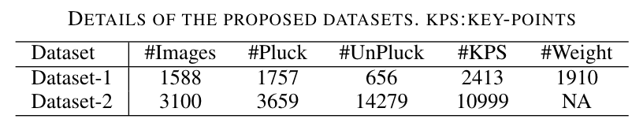

# Strawberry picking point localisation ripeness and weight estimation

<!-- TABLE OF CONTENTS -->
## Table of Contents

* [About the Project](#about-the-project)
* [Usage](#usage)
  * [Annotations](#annotations)
  * [Images and weights annotations](#images-and-weights-annotations)
* [Contact](#contact)


## About The Project

This repository is related to the paper "Strawberry picking point localisation ripeness and weight estimation" accepted for ICRA 2022, PA. 
In particular it contains the 2 novel datasets presented in the paper.




## Usage

### Annotations

In the folder ```annotations/``` the annotations for the 2 datasets are present. They splitted into ```dyson_annotations.zip``` and ```SDI_annotations/```. Every image has its corresponding json file. In each json file the bounding box, the keypoints and the category (ripe/unripe) for each berry present in the image are annotated.

### Images and weights annotations

- **Dataset #1**:  The Dyson dataset can be downloaded from [this link.](https://drive.google.com/drive/folders/1meEKYLgdQpUgkpeqM6VgzHmJg0gNTCx0?usp=sharing). 
This dataset is divded into 4 sub-folders, each including a number of data samples. Each data sample is composed of an image witha number of strawberries annotated as follows: 
    * strawberry_dyson_lincoln_tbd__002_1_pc.ply  <- **Point cloud**
    * strawberry_dyson_lincoln_tbd__002_1_label.npy  <- **Weight**
    * strawberry_dyson_lincoln_tbd__002_1_rdepth.npy  <- **Raw depth image**
    * strawberry_dyson_lincoln_tbd__002_1_bgremoved.png  <- **RGB image without background** 
    * strawberry_dyson_lincoln_tbd__002_1_odepth.png  <- **Colorized depth image**
    * strawberry_dyson_lincoln_tbd__002_1_pdepth.png  <- Colorized depth image (different colormap)
    * strawberry_dyson_lincoln_tbd__002_1_rgb.png  <- **RGB image**
  

- **Dataset #2**: The SDI dataset of images can be instead downloaded from [this link.](https://strawdi.github.io)

## Contact 

- aghalamzanesfahani@lincoln.ac.uk


## License

The materials in this repo can be used under CC-BY-NC-SA license. All data, labels, code and models belong to the Intelligent Manipulation Lab and are freely available for free non-commercial use. 

## For citing this work use this:
```
@inproceedings{tafuro2022strawberry,
  title={Strawberry picking point localization ripeness and weight estimation},
  author={Tafuro, Alessandra and Adewumi, Adeayo and Parsa, Soran and Amir, Ghalamzan E and Debnath, Bappaditya},
  booktitle={2022 International Conference on Robotics and Automation (ICRA)},
  pages={2295--2302},
  year={2022},
  organization={IEEE}
}
```

